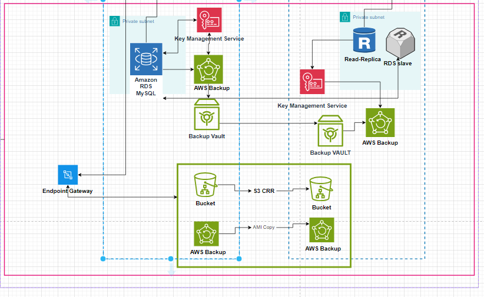
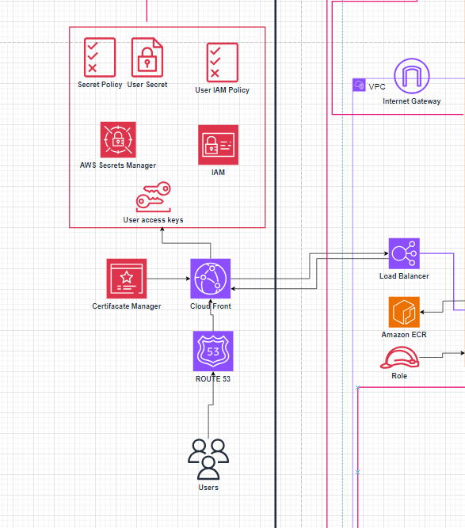
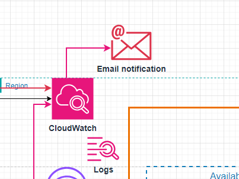

# Projeto de Modernização para AWS com EKS
---

## Descrição do Projeto

Este projeto visa modernizar o sistema fornecido pelo cliente, migrando-o para a infraestrutura de nuvem da AWS e adotando as melhores práticas de arquitetura em nuvem. O sistema atual é composto pelos seguintes componentes:

---

### Infraestrutura Atual
1. *Banco de Dados MySQL:*
  - Armazenamento: 500 GB de dados.
  - Recursos: 10 GB de RAM e 3 CPUs.
2. *Servidor de Frontend (React):*
  - Dados: 5GB.
  - Recursos: 2 GB de RAM e 1 CPU.
3. *Servidor de Backend:*
  - Funcionalidades: Hospeda 3 APIs e utiliza o Nginx como balanceador de carga. Também armazena arquivos estáticos, como imagens e links.
  - Dados: 5 GB.
  - Recursos: 4 GB de RAM e 2 CPUs.
---

### Objetivo
Modernizar o sistema para utilizar uma arquitetura baseada em AWS Elastic Kubernetes Service (EKS), atendendo às seguintes diretrizes:
  -  Ambiente Kubernetes;
  -  Banco de dados gerenciado (PaaS e Multi AZ);
  -  Backup de dados;
  -  Sistema para persistência de objetos (imagens, vídeos etc.);
  -  Segurança;
--- 

## 🚨Observação:
Antes do sistema passar pelo processo de modernização ele precisa passar por um processo de migração para AWS “lift-and-shift” ou “as-is”, neste caso estamos utilizando **lift-and-shift**
  O diagrama do processo de migração está presente no repósitorio de minha dupla deste projeto
  https://github.com/ctrl-brokencode/Projeto-Final-Arquitetura-Migracao
  
---
## Cluster EKS:

#### 1. Amazon EKS:
  - O EKS está no topo do diagrama, representando o plano de controle (control plane) gerenciado pelo serviço da AWS.
  - Função: Coordena as operações do Kubernetes, como agendamento de pods, monitoramento e atualizações automáticas.
  - Vantagem: É altamente disponível, distribuído em múltiplas AZs, e você não precisa gerenciá-lo manualmente.

#### 2. Availability Zones (AZs):
  - São duas AZs representadas, cada uma contendo recursos isolados.
  - Função: Garante alta disponibilidade, pois, se uma AZ falhar, a outra continua operando.
  - Vantagem: Redundância e maior tolerância a falhas.

#### 3. Public Subnet com NAT Gateway:
  - Public Subnet: Hospeda o NAT Gateway.
  - NAT Gateway: Permite que recursos em sub-redes privadas (como nós de trabalho do Kubernetes) acessem a internet para atualizações ou comunicação sem expor seus IPs públicos.
  - Vantagem: Aumenta a segurança, pois os recursos privados não são diretamente acessíveis pela internet.

#### 4. Private Subnet:
  - Contém os nós do Kubernetes (worker nodes) e o plano de controle.
  - Função:
      - Os nós de trabalho (worker nodes) executam os pods (aplicações).
      - O plano de controle gerencia a comunicação entre os nós e os pods.
  - Vantagem: Isolamento e segurança dos componentes principais, protegendo-os de acesso externo.

#### 5. Control Plane
Ele gerencia a operação geral do Kubernetes e é essencial para que o cluster funcione corretamente.
  - Agendar os Pods: Decide em quais worker nodes os contêineres (pods) do frontend e backend serão executados.
  - Garantir que a configuração desejada (definida nos manifests) seja atendida.
  - Monitora os pods nos nós de trabalho para verificar se estão funcionando como esperado.
  - Se algum pod falhar (por exemplo, um contêiner backend cair), o Control Plane inicia automaticamente um novo pod para substituir o que falhou.
  - Facilita a comunicação entre os serviços frontend e backend no cluster.
  - Garante que os serviços sejam registrados corretamente e estejam acessíveis uns para os outros, mesmo que sejam movidos entre os nós.
  - Gerencia configurações de recursos, como:
      - Alocação de memória e CPU para pods.
      - Políticas de segurança (como o isolamento entre pods e namespaces).
  - Trabalha junto com o Auto Scaling para:
      - Ajustar o número de nós de trabalho dinamicamente com base nas cargas de trabalho.
      - Redistribuir pods para novos nós adicionados ao cluster.
  - *Por que ele está em sub-redes privadas?*
      - No diagrama, o Control Plane está isolado em sub-redes privadas, o que aumenta a segurança:
          - Ele não é diretamente acessível pela internet, protegendo-o de acessos não autorizados.
          - A comunicação com ele ocorre apenas via APIs seguras gerenciadas pela AWS (e não diretamente pelos usuários).

#### 6. Worker Nodes (frontend e backend):
  - Distribuídos entre as AZs, cada nó é responsável por executar contêineres de frontend e backend.
  - Frontend: Pode ser uma aplicação web ou interface de usuário.
  - Backend: Lida com lógica de negócios, APIs e comunicação com bancos de dados.
  - Vantagem: Separação de responsabilidades, facilitando escalabilidade independente.

#### 7. Auto Scaling:
  - Responsável por ajustar automaticamente a quantidade de nós do cluster com base na carga de trabalho.
  - Função: Garante que o cluster tenha recursos suficientes para demandas crescentes ou reduz o tamanho para economizar custos.
  - Vantagem: Otimiza custos e desempenho.

#### 8. Comunicação entre Frontend e Backend:
  - O frontend nos nós comunica-se com os pods backend via redes internas.
  - Vantagem: Minimizam latência e aumentam a segurança, pois o tráfego não sai para a internet.

#### 9. Segurança e Redundância:
  - Segurança: Os pods e nós estão em sub-redes privadas, protegidos do acesso externo direto.
  - Redundância: A arquitetura em múltiplas AZs garante alta disponibilidade.
---
## Armazenamento e Backup

##### 1. Amazon RDS MySQL:
  - Um banco de dados relacional gerenciado pela AWS (MySQL).
  - Função:
      - Hospeda dados transacionais ou de aplicação.
      - Fornece backups automatizados e suporte a alta disponibilidade.
  - Contexto no Diagrama:
    - Está em uma sub-rede privada, protegido contra acessos externos.
  - Vantagem: Reduz a complexidade da administração do banco de dados e oferece escalabilidade gerenciada.

#### 2. RDS Read Replica (RDS Slave):
  - Réplica de leitura do banco de dados principal (RDS MySQL).
  - Função:
      - Fornece uma instância secundária para leitura, aliviando a carga de consultas do banco de dados principal.
      - Pode ser usada para recuperação em caso de falha do banco de dados principal.
  - Vantagem: Melhora o desempenho e fornece redundância para alta disponibilidade.

#### 3. Key Management Service (KMS):
  - Serviço de gerenciamento de chaves de criptografia.
  - Função:
      - Criptografa dados armazenados em backups e buckets S3.
      - Garante segurança e conformidade com políticas de proteção de dados.
  - Vantagem: Oferece um meio seguro e centralizado para gerenciar chaves de criptografia.

#### 4. AWS Backup:
  - Serviço gerenciado para orquestrar e automatizar backups de recursos da AWS.
  - Função:
    - Faz backup dos dados do RDS (principal e réplicas) e armazena os backups no Backup Vault.
    - Também cria cópias dos backups no S3 para recuperação e retenção de longo prazo.
 - Vantagem: Automação do processo de backup com suporte a políticas de retenção e replicação.

#### 5. Backup Vault:
  - Repositório centralizado para armazenar backups.
  - Função:
    - Garante armazenamento seguro e criptografado dos backups criados pelo AWS Backup.
  - Vantagem: Centraliza e organiza backups, melhorando a gestão e recuperação.

#### 6. Amazon S3 Buckets:
  - Armazena backups gerados pelo AWS Backup.
  - Função:
      - S3 Cross-Region Replication (CRR): Garante a replicação dos backups entre buckets em diferentes regiões para redundância geográfica.
      - AMI Copy: Pode armazenar imagens de máquinas virtuais para recuperação ou replicação de ambientes.
  - Vantagem: Oferece durabilidade e alta disponibilidade para armazenamento de longo prazo.

#### 7. Endpoint Gateway:
  - Permite que os serviços em sub-redes privadas acessem o S3 diretamente sem expor o tráfego à internet.
  - Função:
      - Facilita o acesso seguro aos buckets S3, mantendo os dados dentro da infraestrutura AWS.
  - Vantagem: Melhora a segurança e reduz custos com transferências de dados pela internet.
---
##  Segurança, Gerenciamento de acessos

#### 1. AWS Secrets Manager:
  - Gerencia segredos, como credenciais de banco de dados, chaves de API ou outros dados sensíveis.
  - Função:
      - Armazena e protege segredos.
      - Atualiza automaticamente credenciais e chaves de acesso.
  - Vantagem: Melhora a segurança ao evitar armazenamento de segredos diretamente no código.

#### 2. AWS Identity and Access Management (IAM):
  - Gerencia permissões e controle de acesso aos recursos da AWS.
  - Função:
      - Define políticas de acesso (IAM Policy) para usuários, grupos ou funções.
      - Protege com autenticação baseada em políticas (User Secret e Secret Policy).
  - Vantagem: Garante que os recursos sejam acessados apenas por usuários autorizados com permissões adequadas.
---
## Entrega de conteúdo

#### 1. AWS Certificate Manager (ACM):
  - Gerencia certificados SSL/TLS.
  - Função:
      - Fornece e renova automaticamente certificados para criptografar a comunicação entre usuários e sistemas.
  - Vantagem: Facilita a implementação de HTTPS para maior segurança na transmissão de dados.

#### 2. Amazon CloudFront:
  - Serviço de CDN (Content Delivery Network).
  - Função:
      - Distribui conteúdo (páginas web, APIs, arquivos estáticos) globalmente com baixa latência.
      - Trabalha junto com o ACM para oferecer HTTPS seguro.
  - Vantagem: Melhora o desempenho e a segurança do acesso dos usuários ao sistema.
    
#### 3. Amazon Route 53:
  - Serviço de DNS gerenciado.
  - Função:
      - Roteia o tráfego do domínio dos usuários para o CloudFront, balanceador de carga ou outros serviços.
  - Vantagem: Oferece alta disponibilidade e roteamento inteligente.
---
## Balanceamento de carga

#### 1. Elastic Load Balancer (Load Balancer):
  - Distribui o tráfego entre várias instâncias ou serviços.
  - Função:
      - Gerencia a carga de trabalho para evitar sobrecarga em uma única instância.
      - Fornece redundância e resiliência.
  - Vantagem: Melhora a escalabilidade e resiliência do sistema.
---
## Amazon ECR (Elastic Container Registry):
Armazena imagens de contêineres Docker  servindo como repositório central para armazenar e versionar imagens de contêiner.

## Internet Gateway:

Permite que recursos em sub-redes públicas se comuniquem com a internet proporcionando acesso bidirecional entre a VPC e a internet.

---
## Monitoramento e Notificações

#### 1. Amazon CloudWatch
  - Coleta e armazena logs (como logs de aplicação, sistema ou eventos).
  - Monitora métricas configuradas, como uso de CPU, memória, tráfego de rede ou falhas em recursos.
  - Configura alarmes baseados em thresholds predefinidos (ex.: alertar se o uso de CPU exceder 80%).

#### 2. Email Notification (via Amazon SNS ou CloudWatch Alarms)
  - Notifica a equipe sobre problemas críticos, como falhas, picos de uso, ou indisponibilidade de recursos.
  - Permite uma resposta rápida para incidentes que podem impactar o sistema ou a experiência do usuário.

#### 3. Logs
  - Representa os registros detalhados de atividades e eventos gerados por aplicações e serviços.
  - Usado para depuração, auditoria e análise do comportamento do sistema.

---

## Sistema Completo do Cluster EKS

---

## AWS Princing Calculator:

Foi utilizado o serviço AWS Princing Calculator é uma ferramenta que ajuda a estimar os custos do serviços que serão utilizados na AWS para a Mordenização desse sistema para cluster EKS

| Serviço                  | Custo (USD) | Região            |
|--------------------------|-------------|-------------------|
| Cluster EKS             | 73,00       | North Virgínia    |
| MySQL                   | 381,28      | North Virgínia    |
| Nodes EC2               | 46,76       | North Virgínia    |
| Load Balancer           | 75,43       | North Virgínia    |
| Bucket S3               | 0,26        | North Virgínia    |
| CloudWatch              | 29,16       | North Virgínia    |
| AWS Backup              | 3,45        | North Virgínia    |
| ECR                     | 4,00        | North Virgínia    |
| AWS Secrets Manager     | 0,40        | North Virgínia    |
**Total mensal: 613,74 USD**    |  **Total anual: 7.365,00 USD**
